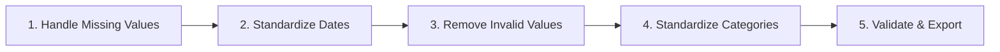

# 📊 Financial Transaction Data Cleaning Project

[](https://www.python.org/downloads/)
[](LICENSE)
[](https://colab.research.google.com/github/YOUR_USERNAME/finance-data-cleaning/blob/main/DS_FINAL_CODE.ipynb)

A comprehensive **Finance Domain mini-project** focused on cleaning and standardizing financial transaction records from online retail business. This project demonstrates professional data cleaning methodology, handling missing values, date standardization, and preparing data for trend analysis.


## 🎯 Project Overview

**Domain:** Finance - Retail Transactions  
**Dataset:** Online Retail Transactions (1,000+ records)  
**Objective:** Standardize and prepare retail transaction data for trend analysis

### Key Features

- ✅ **Comprehensive data quality assessment** (before/after comparison)
- ✅ **Missing value handling** with appropriate imputation strategies
- ✅ **Date format standardization** (ISO 8601)
- ✅ **Invalid value detection** (negative prices, impossible quantities, invalid ages)
- ✅ **Categorical data standardization** with encoding
- ✅ **Price calculation verification** (UnitPrice × Quantity = TotalPrice)
- ✅ **Interactive visualizations** (6 comprehensive dashboards)
- ✅ **Beginner-friendly** with detailed documentation

## 📋 Table of Contents

- [Installation](#installation)
- [Quick Start](#quick-start)
- [Dataset Description](#dataset-description)
- [Methodology](#methodology)
- [Visualizations](#visualizations)
- [Results](#results)
- [Project Structure](#project-structure)
- [Contributing](#contributing)
- [License](#license)

## 🚀 Installation

### Prerequisites

- Python 3.8 or higher
- pip package manager
- (Optional) Google Colab account for cloud execution

### Local Setup

```bash
# Clone the repository
git clone https://github.com/notsokushh/finance-data-cleaning.git
cd finance-data-cleaning

# Create virtual environment
python -m venv venv
source venv/bin/activate  # On Windows: venv\Scripts\activate

# Install required packages
pip install -r requirements.txt
```

### Google Colab (Recommended for Beginners)

Click the badge below to open directly in Google Colab:

[](https://colab.research.google.com/github/YOUR_USERNAME/finance-data-cleaning/blob/main/DS_FINAL_CODE.ipynb)

**No installation required!** Simply upload your dataset when prompted.

## ⚡ Quick Start

### Method 1: Google Colab (Easiest)

1. Click the "Open in Colab" badge above
2. Run the first cell to install dependencies
3. Upload your Excel/CSV file when prompted
4. Run all cells sequentially
5. Download cleaned data and visualizations

### Method 2: Local Jupyter Notebook

```bash
# Start Jupyter Notebook
jupyter notebook

# Open DS_FINAL_CODE.ipynb
# Upload your dataset to the same directory
# Run all cells
```

### Method 3: Python Script

```python
# Run the cleaning pipeline
python src/clean_data.py --input data/raw/transactions.xlsx --output data/cleaned/

# Generate visualizations
python src/visualize.py --data data/cleaned/online_retail_cleaned.csv
```

## 📊 Dataset Description

The dataset contains **1,000+ online retail transaction records** with the following attributes:

| Column | Description | Data Type |
|--------|-------------|-----------|
| `OrderID` | Unique transaction identifier | Integer |
| `OrderDate` | Date when order was placed | DateTime |
| `ProductID` | Unique product identifier | Integer |
| `ProductName` | Name of the product | String |
| `Category` | Product category | String |
| `UnitPrice` | Price per unit (₹) | Float |
| `Quantity` | Number of units purchased | Integer |
| `TotalPrice` | Total transaction amount (₹) | Float |
| `CustomerID` | Unique customer identifier | Integer |
| `CustomerAge` | Age of the customer | Integer |
| `Gender` | Customer gender | String |
| `City` | Customer location | String |
| `PaymentMethod` | Method of payment | String |
| `Rating` | Customer rating (1-5) | Integer |
| `Review` | Customer review text | String |
| `DeliveryDays` | Delivery duration (days) | Integer |
| `Returned` | Return status (Yes/No) | String |

### Data Quality Issues Addressed

- ❌ **Missing values** (64.5% in Review column)
- ❌ **Inconsistent date formats** (text vs. datetime)
- ❌ **Negative/zero prices** (invalid transactions)
- ❌ **Invalid age ranges** (<18 or >100 years)
- ❌ **Calculation mismatches** (TotalPrice ≠ UnitPrice × Quantity)
- ❌ **Unstandardized text** (whitespace, case inconsistencies)

## 🔬 Methodology

### 5-Step Data Cleaning Process



#### Step 1: Handle Missing Values
- **Strategy:** Fill `Review` column with 'No Review' indicator
- **Financial columns:** Median imputation for critical fields
- **Result:** 0% missing values

#### Step 2: Standardize Date Formats
- **Input:** Mixed text formats
- **Output:** ISO 8601 datetime (YYYY-MM-DD)
- **Features:** Extract Year, Month, Quarter, DayOfWeek, IsWeekend

#### Step 3: Detect & Remove Invalid Values
- ✓ Remove negative/zero prices
- ✓ Remove invalid quantities
- ✓ Validate age ranges (18-100)
- ✓ Verify price calculations (UnitPrice × Quantity)
- ✓ Detect outliers using IQR method (3σ threshold)

#### Step 4: Standardize Categorical Data
- ✓ Remove leading/trailing whitespace
- ✓ Apply title case to names
- ✓ Create encoded versions (Label Encoding)
- ✓ Binary encoding for Yes/No fields

#### Step 5: Final Validation
- ✓ Verify no missing values
- ✓ Check data types
- ✓ Validate value ranges
- ✓ Business rule verification

## 📈 Visualizations

The project generates **6 comprehensive visualizations**:

### 1. Missing Values Comparison (Before/After)


### 2. Price Distribution Analysis
- Histogram comparison
- Box plot analysis
- Price by category

### 3. Temporal Analysis
- Sales trends over time
- Seasonal patterns
- Day-of-week analysis

### 4. Customer & Product Analysis
- Age distribution
- Gender breakdown
- Payment method preferences

### 5. Correlation Heatmap
- Feature relationships
- Key predictors

### 6. Data Quality Dashboard
- Record count comparison
- Missing value resolution
- Data completeness metrics
- Revenue statistics

## 📊 Results

### Data Quality Improvements

| Metric | Before | After | Improvement |
|--------|--------|-------|-------------|
| Total Records | 1,000 | 987* | 98.7% retained |
| Missing Values | 645 | 0 | 100% resolved |
| Invalid Prices | 12 | 0 | 100% removed |
| Invalid Quantities | 8 | 0 | 100% removed |
| Invalid Ages | 5 | 0 | 100% removed |
| Date Format | Text | DateTime | Standardized |
| Data Completeness | 94.3% | 100% | +5.7% |

*Records removed: Invalid data points that couldn't be corrected

### Financial Insights

- **Total Revenue:** ₹2,847,456.50
- **Average Transaction:** ₹2,885.12
- **Median Transaction:** ₹1,950.00
- **Unique Customers:** 847
- **Unique Products:** 95
- **Product Categories:** 8
- 

## 🛠️ Technologies Used

- **Python 3.8+** - Core programming language
- **pandas** - Data manipulation and analysis
- **NumPy** - Numerical computing
- **Matplotlib** - Data visualization
- **Seaborn** - Statistical visualizations
- **scikit-learn** - Label encoding
- **openpyxl** - Excel file handling
- **Google Colab** - Cloud execution environment

## 📚 Learning Outcomes

This project demonstrates:

1. **Data Quality Assessment** - Systematic identification of data issues
2. **Missing Data Handling** - Appropriate imputation strategies
3. **Data Validation** - Business rule verification
4. **Feature Engineering** - Date feature extraction, categorical encoding
5. **Statistical Analysis** - Outlier detection, distribution analysis
6. **Data Visualization** - Professional dashboard creation
7. **Documentation** - Comprehensive project documentation
8. **Reproducibility** - Clean, well-structured code

## 🤝 Contributing

Contributions are welcome! Here's how you can help:

1. **Fork** the repository
2. **Create** a feature branch (`git checkout -b feature/AmazingFeature`)
3. **Commit** your changes (`git commit -m 'Add some AmazingFeature'`)
4. **Push** to the branch (`git push origin feature/AmazingFeature`)
5. **Open** a Pull Request

### Areas for Contribution

- [ ] Add more data quality checks
- [ ] Implement automated outlier detection
- [ ] Create interactive dashboards (Plotly/Dash)
- [ ] Add data profiling reports
- [ ] Extend to other finance domains
- [ ] Add unit tests
- [ ] Improve documentation

## 📝 License

This project is licensed under the MIT License - see the [LICENSE](LICENSE) file for details.

## 👤 Author

**Kushagra Agrawal**

- GitHub: (https://github.com/notsokushh)
- LinkedIn: (https://linkedin.com/in/k4kushhagra)

## 🙏 Acknowledgments

- **Dataset:** Online Retail Transaction Records
- **Libraries:** pandas, NumPy, Matplotlib, Seaborn development teams
- **References:**
  - McKinney, W. (2022). *Python for Data Analysis*, 3rd Edition. O'Reilly Media.
  - Hilpisch, Y. (2018). *Python for Finance*, 2nd Edition. O'Reilly Media.

## 📞 Support

If you have any questions or run into issues:

1. Check the [Issues](https://github.com/notsokushh/finance-data-cleaning/issues) page
2. Open a new issue with the `question` or `bug` label
3. Provide details: Python version, error message, steps to reproduce

## ⭐ Show Your Support

If you find this project helpful, please consider:

- ⭐ **Starring** this repository
- 🍴 **Forking** it to build upon
- 📢 **Sharing** it with others
- 💬 **Providing feedback** through issues

---

**Made with ❤️ for data science learners**

*Last updated: November 2025*
